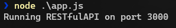
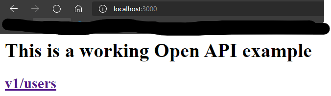
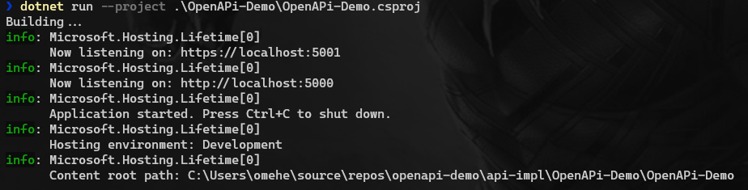
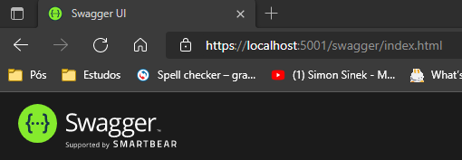

# OpenAPI Demo
> Este repositório contem um projeto com duas aplicações sendo elas:
- 1º) Node com Express e Swagger-UI -OpenAPI Spec
- 2º) ASP.NET Core WebAPI
> Ambas representam a mesma API porem deixando separado a especificação(OpenAPI) e a implementação.

## Executando a Especificação(OpenAPI)
Estando na raiz do projeto OpenAPI-Demo segue os passos abaixo:
Navegando para a pasta api-design

````powershell
cd api-design
````

Instalando as dependencias:

````powershell
npm install
````

Executando a aplicação:

````powershell
node .\app.js
````

Resultado deve ser este:





## Executando a API Implementada
Estando na raiz do projeto OpenAPI-Demo segue os passos abaixo:
Navegando para a pasta OpenAPI-Demo

````powershell
cd api-impl\OpenAPI-Demo
````

Instalando as dependencias:

````powershell
dotnet restore
````

Compile a aplicação para verificar se está tudo ok

````powershell
dotnet build
````

Executando a aplicação:

````powershell
dotnet run --project .\OpenAPi-Demo\OpenAPi-Demo.csproj
````




